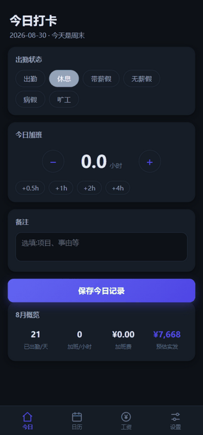
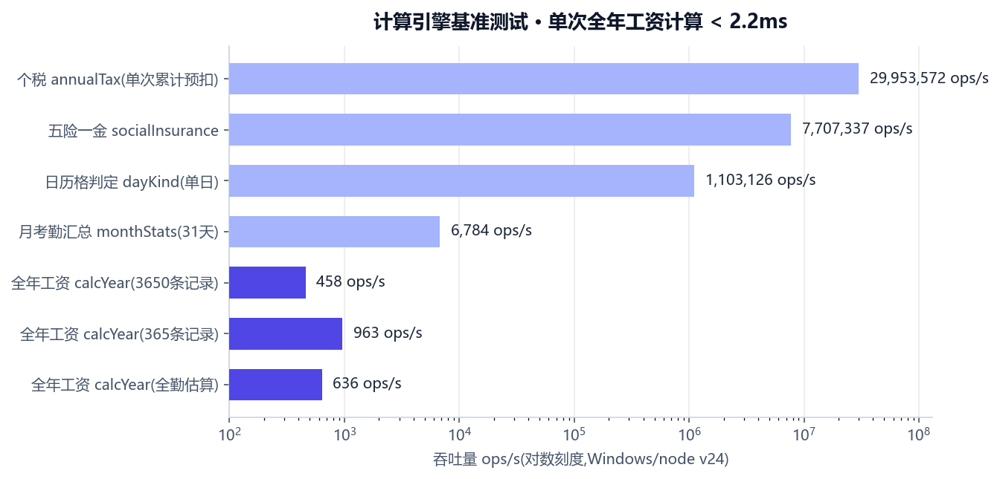

# 打工人账本 · Dagong Ledger

> 考勤 + 加班 + 工资估算,数据存在自己设备里的记账本。
> Local-first attendance & overtime tracking with payroll estimation — works on phone, tablet and desktop.

[](https://github.com/violet-3/Account_Book/actions/workflows/ci.yml)
[](../../releases)
[](LICENSE)
[](#)


<p align="center">
  
</p>

## Quick Start 快速开始

1. **Run / 运行**:`node server.js` → open <http://localhost:5173> (零依赖,无需 npm install / zero-dependency)
2. **Deploy / 部署**:把文件夹丢到任意静态托管(GitHub Pages / Vercel / Netlify),或 `docker run -p 5173:5173` 本地容器
3. **Install / 安装**:手机浏览器打开 → 「添加到主屏幕」,像原生 App 一样离线使用 / Add to Home Screen for offline use

---

## 一键部署 · One-click Deploy

把仓库部署成**你自己的**离线记账本:数据 100% 存在你使用的那台设备浏览器里,不同设备互不相通。

<p>
  <a href="https://app.netlify.com/start/deploy?repository=https://github.com/violet-3/Account_Book">
    
  </a>
  &nbsp;
  <a href="https://vercel.com/new/clone?repository-url=https%3A%2F%2Fgithub.com%2Fviolet-3%2FAccount_Book&project-name=dagong-ledger">
    
  </a>
</p>

- **Netlify / Vercel**:点按钮 → 授权 → 自动建站 → 得到专属网址;手机浏览器打开 → 「添加到主屏幕」→ 离线记账 App ✅(仓库每次更新,站点自动同步)
- **GitHub Pages**:本仓库已内置 Pages 工作流,推送 main 自动发布到 `https://violet-3.github.io/Account_Book/`(首次需在 Settings → Pages 把 Source 设为 **GitHub Actions**)
- **本地运行**:`git clone` 后 `node server.js`,或直接双击 `index.html`(离线,无 PWA 安装能力)

---

## 功能特性

- **今日打卡**:出勤状态(出勤 / 休息 / 带薪假 / 无薪假 / 病假 / 旷工)+ 加班时长一键记录;显示在岗状态与下班倒计时;自动识别工作日、周末、法定节假日、调休日,自动匹配 1.5× / 2× / 3× 加班倍率
- **排班制度**:双休 / 单休 / **大小周**(指定本周类型后按周自动交替推算),上下班时间可配,同步影响应出勤、缺勤判定与加班倍率
- **出勤日历**:月视图状态着色 + 加班角标,点任意日期弹层编辑;节假日数据**按年自动更新**(内置 2025–2026,其他年份自动在线获取并缓存,离线优雅降级)
- **工资估算**:加班费(倍率可改)、缺勤扣款、五险一金(内置 16 城个人比例与基数上下限,可改)、个税**累计预扣预缴法**(5000 起征,支持专项附加扣除),工资条式明细 + 全年实发走势图
- **加班补偿**:加班费 / **调休折算**(累计可休时长) / 仅记录,三种模式
- **攒钱规划**:储蓄目标(旅行、恋爱基金、应急备用金、买房首付等 12 个模板)+ 存款流水 + 年度储蓄预估(计划口径与实际速度双口径),预计达成年月一目了然
- **数据自主**:100% 存本地浏览器,不注册不上传;JSON 导出 / 导入备份
- **三端适配**:手机 / 平板 / 桌面响应式布局,深色模式跟随系统
- **Excel 兼容导出**:可在设置中导出 UTF-8 CSV,使用 Excel 直接打开或另存为 `.xlsx`

## 性能 Performance

计算引擎为纯函数,最重的「全年 12 个月工资计算」在 10 年数据量(3650 条考勤)下单次耗时 **< 2.2ms**。



复现:`npm run bench`(脚本:[test/bench.mjs](test/bench.mjs),结果因机器而异)。

## 开发 Development

```bash
npm install        # 仅安装 eslint(devDependency)
npm test           # 41 项单元测试(计算引擎 + 节假日解析)
npm run lint       # ESLint
npm run bench      # 基准测试
npm run mobile:sync # 同步 Capacitor 原生工程
npm run mobile:android # 打开 Android Studio
npm run mobile:ios # 打开 Xcode(macOS)
```

## 手机客户端封装

项目使用 Capacitor 复用同一套 Web 业务代码，原生工程为 `android/` 和 `ios/`。执行 `npm run mobile:sync` 后，可用 Android Studio 或 Xcode 构建 APK/AAB 或 iOS 应用。iOS 构建需要 macOS、Xcode 和 Apple Developer 签名；客户端默认离线运行，数据保存在本机。

<details>
<summary>目录结构 Structure</summary>

```
index.html          页面与 Vue 模板
css/style.css       样式(移动优先,三档断点,深色模式)
js/data.js          城市五险一金参数 + 内置节假日(2025–2026)
js/holiday.js       节假日按年自动更新(holiday-cn + jsDelivr + 本地缓存)
js/calc.js          计算引擎(加班费/社保/个税,纯函数)
js/db.js            localStorage 持久层 + JSON 导入导出
js/app.js           Vue 3 应用逻辑
server.js           零依赖静态服务器(支持 PORT 环境变量)
sw.js               PWA 离线缓存(network-first)
test/               单元测试与基准测试
Dockerfile          容器化部署
```

</details>

<details>
<summary>计算口径说明 Calculation rules</summary>

- 月计薪天数 21.75 天;日薪 = 月薪 ÷ 21.75,时薪 = 日薪 ÷ 8
- 加班费:工作日 ×1.5、周末 ×2、法定节假日 ×3(可自定义,或改为"仅记录不计费")
- 缺勤扣款:无薪假 / 旷工按 1 × 日薪
- 五险一金:缴费基数 = min(max(基数, 下限), 上限);城市参数为参考值(每年约 7 月调整),请按当地当年公布口径在设置中校正
- 个税:按年度税率表累计预扣,累计应纳税所得额 = 年初至本月应发累计 − 五险一金 − 5000/月 − 专项附加扣除
- 未记录考勤的月份按全勤估算;估算仅供参考,不构成法律依据

</details>

## 部署方式 Deploy

### 访客安装到手机

推荐先点击上方 Netlify 或 Vercel 的一键部署按钮，为自己创建一个独立网址，再用手机打开该网址：

- Android Chrome：点击页面的“立即安装”，或浏览器菜单中的“安装应用”。
- iPhone / iPad：使用 Safari 打开网址，点击“分享”→“添加到主屏幕”。iOS 不支持在普通网页中弹出 Android 式安装按钮。
- 安装后可以离线记账。数据默认只保存在当前设备、当前浏览器的本地存储中，不会自动同步到其他设备。
- 更换设备、清理浏览器数据或卸载应用前，请在“设置 → 数据”导出 JSON 备份；“导出 Excel 表格”生成的 CSV 文件可以直接用 Excel 打开。

完整 PWA 安装需要 HTTPS（GitHub Pages、Netlify、Vercel 默认支持）。直接双击 `index.html` 可以使用基础记账功能，但浏览器通常不会提供 PWA 安装能力。

| 方式 | 命令 | 说明 |
|---|---|---|
| Node | `node server.js` | 零依赖,支持 `PORT` 环境变量 |
| Docker | `docker build -t dagong-ledger . && docker run -p 5173:5173 dagong-ledger` | 一键容器化 |
| 静态托管 | 上传整个文件夹 | GitHub Pages / Vercel / Netlify,支持 PWA 安装 |
| 离线直开 | 双击 `index.html` | 数据照常保存,无 PWA 安装能力 |

## Roadmap

- [ ] 年度考勤报告(加班 Top、平均下班时间)
- [ ] 多份工资设置切换(兼职场景)
- [ ] iOS 添加到主屏幕的启动屏适配

## License

[MIT](LICENSE) · 数据与费率估算仅供参考,不构成任何法律依据。

> 把 `YOUR_USERNAME` 替换为你的 GitHub 用户名即可激活徽章与 Release 链接。
